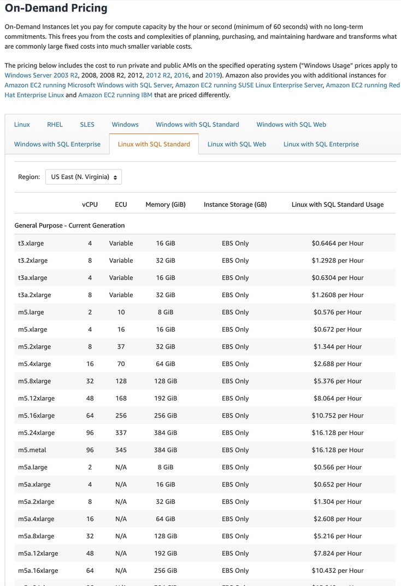

# KubeML

## Introduction

KubeML is a PaaS that directly competes with AWS SageMaker for building, training, and testing machine-learning models. KubeML provisions cloud infrastructure based on client needs and launches a Jupyter Enterprise deployment. Client's access JupyterHub for launching multiple kernels. KubeML deploys the identical, open-source Jupyter IDE environment as AWS SageMaker without the price mark-up.

<!--  -->

  

  

  

  

## Advantages

KubeML is significantly cheaper than AWS SageMaker (40% cheaper for on-demand usage, 65% cheaper for long-term usage).

  

  

## How it works

KubeML leverages Kubernetes to efficiently distribute user notebook instances and user kernels across cloud infrastructure.

  

## Current Features

KubeML is currently only offering 30 minute trials

  

