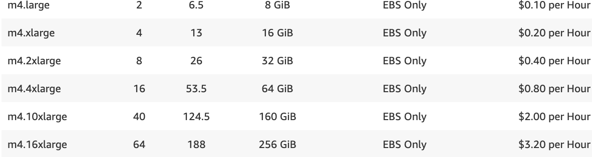
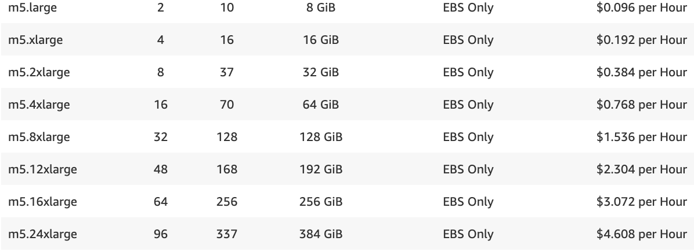

# KubeML

## Introduction

KubeML is a PaaS that directly competes with AWS SageMaker for building, training, and testing machine-learning models. KubeML provisions cloud infrastructure based on client needs and launches a Jupyter Enterprise deployment. Client's access JupyterHub for launching multiple kernels. KubeML deploys the identical, open-source Jupyter IDE environment as AWS SageMaker without the price mark-up.

<!--  -->

<h4 align="center">KubeML Jupyterhub Notebook</h4>

  

<h4 align="center">AWS SageMaker Jupyterhub Notebook</h4>

  

<h4 align="center">KubeML Python3 Kernel</h4>

  

<h4 align="center">SageMaker Python3 kernel</h4>

  

 

## Advantages

Based on your organization's usage scenario, KubeML sizes ec2 reserved instances and/or on-Demand instances. KubeML is cheaper than SageMaker in both on-Demand and reserved instances. AWS marks up SageMaker ec2 instances 40% higher vs on-Demand and 222% vs reserved instances.

Pricing Example for m5.2xlarge:

- SageMaker: \$0.538/hr
- KubeML-onDemand: \$0.384/hr
- KubeML-reserved: \$0.242/hr

<h4 align="center">AWS ec2 onDemand Pricing</h4>

  

  

<h4 align="center">AWS SageMaker Pricing</h4>

  

 

## How it works

KubeML leverages Kubernetes to efficiently distribute user notebook instances and user kernels across cloud infrastructure.

  

## Current Features

KubeML is currently only offering 30 minute trials

  

