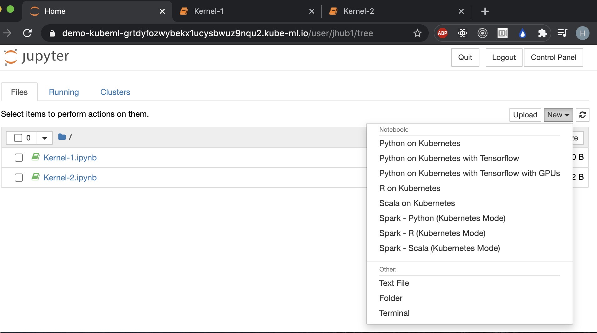
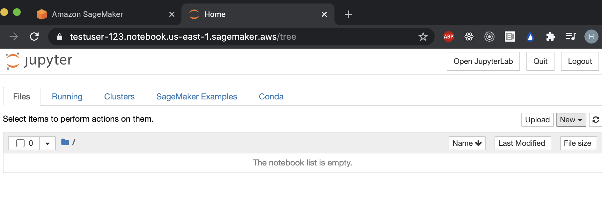
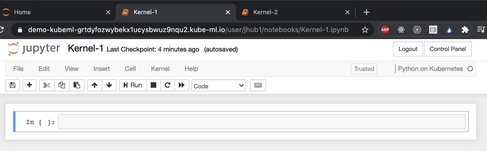
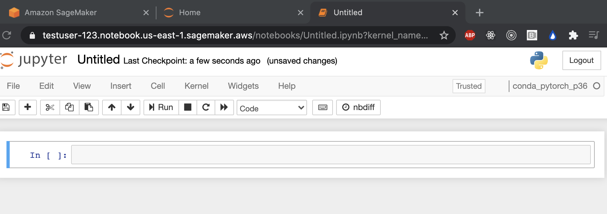
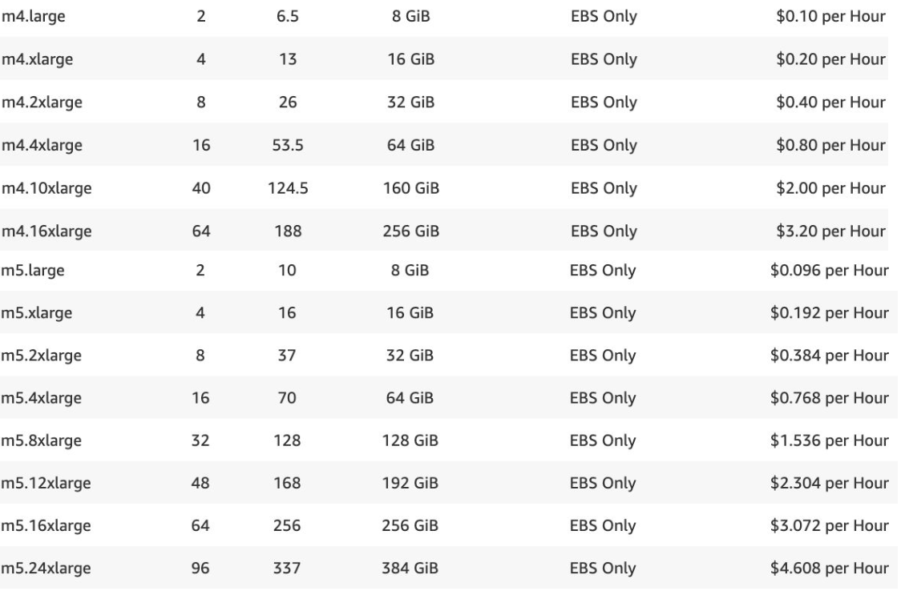
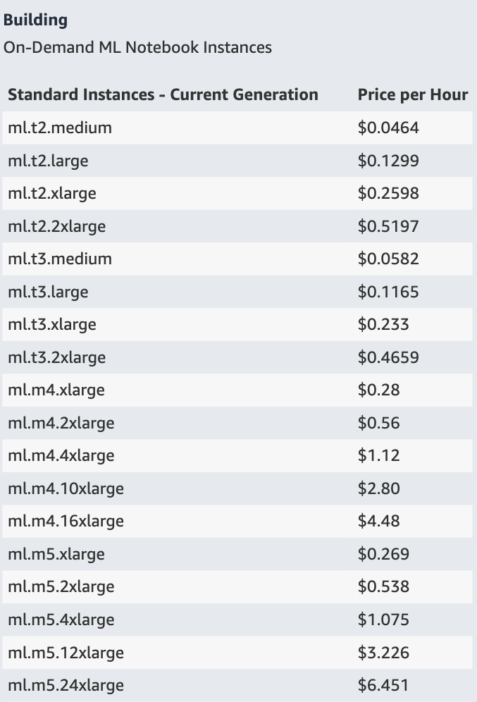
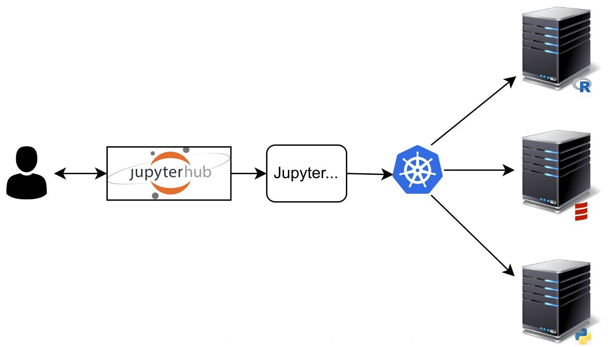
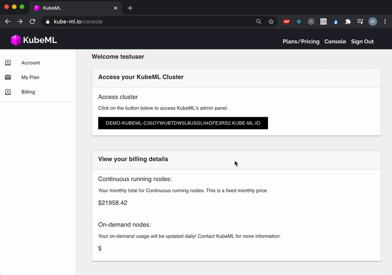

# KubeML

## Introduction

KubeML is a PaaS that directly competes with AWS SageMaker for building, training, and testing machine-learning models. KubeML provisions cloud infrastructure based on client needs and launches a Jupyter Enterprise deployment. Client's access JupyterHub for launching multiple kernels. KubeML deploys the identical, open-source Jupyter IDE environment as AWS SageMaker without the price mark-up.

<!--  -->

<h4 align="center">KubeML Jupyterhub Notebook</h4>
<p align="center">
  
</p>

<h4 align="center">AWS SageMaker Jupyterhub Notebook</h4>
<p align="center">
  
</p>

<h4 align="center">KubeML Python3 Kernel</h4>
<p align="center">
  
</p>

<h4 align="center">SageMaker Python3 kernel</h4>
<p align="center">
  
</p>

<br/>

## Advantages

Based on your organization's usage scenario, KubeML sizes ec2 reserved instances and/or on-Demand instances. KubeML is cheaper than SageMaker in both on-Demand and reserved instances. AWS marks up SageMaker ec2 instances 40% higher vs on-Demand and 222% vs reserved instances.

Pricing Example for m5.2xlarge:

- SageMaker: \$0.538/hr
- KubeML-onDemand: \$0.384/hr
- KubeML-reserved: \$0.242/hr

<h4 align="center">AWS ec2 onDemand vs SageMaker Pricing</h4>
<p align="center">
   
</p>

<br/>

## How it works

AWS SageMaker forces each user to launch an individual ec2 instance for hosting the user's Jupyterhub Notebook instance and any kernels the user launches. KubeML handles the responsibility of sizing ec2 instances for your entire organization. KubeML leverages Kubernetes to deploy each user's Jupyterhub Notebook instance and their individual kernels across all worker nodes in the cluster.

<p align="center">
  
</p>

<br/>

## Current Features

Visit Kube-ml.io and sign-up to access a free 30 minute trial of KubeML's Jupyter Notebooks deployment.

<p align="center">
  
</p>
```
